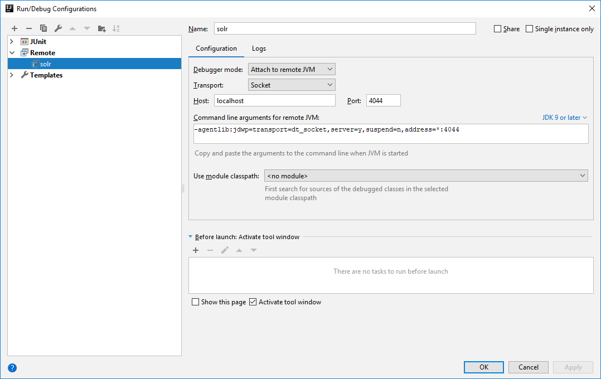

# SOLR Custom Data Import Handler (Customizing the JDBC API to support REST services)

This project aims to explain how extend SOLR to create a custom SOLR data import handler.
Remember that if your necessities are well supplied by the available data import handlers of SOLR, make their use before to think about create a custom indexer.
A custom data import handler is a good choice when we want to index JSON objects keeping the SOLR project simplicity. 
These cases remove the necessity of third-party applications to manage custom data-extraction and indexation by means of REST call to SOLR API.
Create a custom indexer the process is very straightforward due to the fact that SOLR projects is very extensible.
Following will be presented the details about the implementation.

## SOLR Configuration

Download the latest version (in this example the version used was 7.6.0) from the official [SOLR link](http://www.apache.org/dyn/closer.lua/lucene/solr/7.6.0/solr-7.6.0.tgz).
After that, extract the binary to some folder from your file system, e.g. *C:\java\solr-7.6.0*.
And then start the SOLR using the following command line:

> cd C:\java\solr-7.6.0\bin <br /> solr start

To create a new SOLR core execute the following command:

> solr create_core -c solr-custom-data-indexer-core

We need to create a lib folder that will hold all dependencies necessary to create our custom SOLR indexer.

> cd server\solr\solr-custom-data-indexer-core <br />mkdir lib

Then download and copy the data import handler jar [solr-dataimporterhandler-7.6.0](solr-configuration/lib/solr-dataimporthandler-7.6.0.jar), this jar is available in the *dist* of SOLR project.
The classes inside this jar are the one that we will extend to create our custom indexer.

### Configuring Managed Schema

As we are simulating here a example scenario, the data is not real (company and employee).
The data used here is available on the [assets ](assets) folder of the [GIT](https://github.com/schmittjoaopedro/joaoschmitt.wordpress.com/tree/master/custom-solr-data-indexer) repo.
The dataset contains a relationship between employees with departments (given the foreign key *departmentId* field).
To persist this data in our SOLR core, first is necessary to configure the *managed-schema* file, therefore add the following entries at the *managed-schema* file after the id entry.

```xml
...
<field name="id" type="string" indexed="true" stored="true" required="true" multiValued="false" />
<field name="firstName" type="string" indexed="true" stored="true" multiValued="false" />
<field name="lastName" type="string" indexed="true" stored="true" multiValued="false" />
<field name="age" type="pint" indexed="true" stored="true" multiValued="false" />
<field name="companyId" type="pint" indexed="true" stored="true" multiValued="false" />
<field name="companyVersion" type="pint" indexed="true" stored="true" multiValued="false" />
<field name="companyName" type="string" indexed="true" stored="true" multiValued="false" />
...
```

### Configuring solrconfig.xml

In *solrconfig.xml* we need to add a new entry to determine the dataimport handler support.
Add the following entry in the file:

```xml
...
<requestHandler name="/dataimport" class="org.apache.solr.handler.dataimport.DataImportHandler">
    <lst name="defaults">
        <str name="config">data-config.xml</str>
    </lst>
</requestHandler>
...
```

After that, create the *data-config.xml* file inside the */conf* folder inside our solr core.
The *data-config.xml* file holds the configuration to determine how the data import handler will process the data to be indexed.
Our file is customized because we are extending the default engine of SOLR to support a indexation mechanins by REST service.
The following content must to be put inside the *data-config.xml* file.
The processor tag is modified to indicate our custom classes to handle the data import, and the JDBC is not necessary in this case.

```xml
<dataConfig>
    <!-- 
    In this case the JDBC configuration isn't necessary 
    because we are creating a custom implementation 
    -->
    <document>
        <entity
            name="employee"
            pk="id"
            query="true"
            deltaQuery="true"
            deltaImportQuery="true"
            deletedPkQuery="true"
            processor="com.github.schmittjoaopedro.EmployeeProcessor" >
            <entity 
                name="company"
                query="true"
                processor="com.github.schmittjoaopedro.CompanyProcessor">
            </entity>
            <field name="id" column="id" />
            <field name="firstName" column="firstName" />
            <field name="lastName" column="lastName" />
            <field name="age" column="age" />
            <field name="departmentId" column="departmentId" />
            <field name="departmentName" column="departmentName" />
        </entity>
    </document>
</dataConfig>
```

The full SOLR core configuration is available in this [link](https://github.com/schmittjoaopedro/joaoschmitt.wordpress.com/tree/master/custom-solr-data-indexer/solr-custom-data-indexer-core).

## Java project

One of the easist way to create a custom data import handler is using a Maven Java Project.

### Maven configuration

To this create a project and add the following dependencies in the *pom.xml*.
All provided dependencies are included for development purporses because they are supplied by SOLR when we start the server.
The junit is used for test, and the remaining dependencies are artifacts to allow our custom implementation retrieve data via REST API (jetty client) and process the JSON response (Gson).

```xml
<dependencies>
    <dependency>
        <groupId>junit</groupId>
        <artifactId>junit</artifactId>
        <version>4.11</version>
        <scope>test</scope>
    </dependency>
    <dependency>
        <groupId>org.eclipse.jetty</groupId>
        <artifactId>jetty-client</artifactId>
        <version>9.4.11.v20180605</version>
    </dependency>
    <dependency>
        <groupId>com.google.code.gson</groupId>
        <artifactId>gson</artifactId>
        <version>2.8.5</version>
    </dependency>
    <dependency>
        <groupId>org.slf4j</groupId>
        <artifactId>slf4j-api</artifactId>
        <version>1.7.24</version>
        <scope>provided</scope>
    </dependency>
    <dependency>
        <groupId>joda-time</groupId>
        <artifactId>joda-time</artifactId>
        <version>2.2</version>
        <scope>provided</scope>
    </dependency>
    <dependency>
        <groupId>org.apache.commons</groupId>
        <artifactId>commons-lang3</artifactId>
        <version>3.6</version>
        <scope>provided</scope>
    </dependency>
    <dependency>
        <groupId>org.apache.solr</groupId>
        <artifactId>solr-core</artifactId>
        <version>7.6.0</version>
        <scope>provided</scope>
    </dependency>
    <dependency>
        <groupId>org.apache.solr</groupId>
        <artifactId>solr-dataimporthandler</artifactId>
        <version>7.6.0</version>
        <scope>provided</scope>
    </dependency>
</dependencies>
```

After we built the jar we need to copy this one to the lib folder created before in our SOLR core.
As we have external dependencies (Gson and Jetty Client) we need to make a jar with the dependencies.
Then add the following plugin to the *pom.xml* file.

```xml
<plugin>
    <artifactId>maven-assembly-plugin</artifactId>
    <configuration>
        <descriptorRefs>
            <descriptorRef>jar-with-dependencies</descriptorRef>
        </descriptorRefs>
    </configuration>
    <executions>
        <execution>
            <phase>package</phase>
            <goals>
                <goal>single</goal>
            </goals>
        </execution>
    </executions>
</plugin>
```

### Data structure

The data used to simulate ou custom extension is available in the [assets](https://github.com/schmittjoaopedro/joaoschmitt.wordpress.com/tree/master/custom-solr-data-indexer/assets) link.
The assets folder contains the *company_v1_full* and *company_v2_full* files, that simulate the database of companies in version one and two.
Besides that, in our *assets* folder, the employee is organized in the same way, where *employee_v1_full* and *employee_v2_full* contains the full databse in version one and two, while file *employee_v2_modified* contains the created/updated delta between version one and two and the file *employee_v2_removed* contains the removed entries. 

### Extending the SOLR Java API

# Executing custom jar on SOLR

To execute our custom data indexer on SOLR, first build the application using the maven command:

> mvn clean package

After that, copy the .jar generated under the lib folder into the SOLR core folder (C:\java\solr-7.6.0\server\solr\solr-custom-data-indexer-core\lib).
Besides that, copy the following dependencies too:

* https://mvnrepository.com/artifact/com.google.code.gson/gson/2.8.5
* https://mvnrepository.com/artifact/org.jboss.resteasy/resteasy-client/3.6.2.Final

To debug our source code start the solr using the following commands. First stop all SOLR instances:

> solr stop -all

Then start a new instance in debug mode:

> solr start -a "-Xdebug -Xrunjdwp:transport=dt_socket,server=y,suspend=y,address=4044"

And configure a remote debug in IntelliJ (or eclipse) like the following image:



